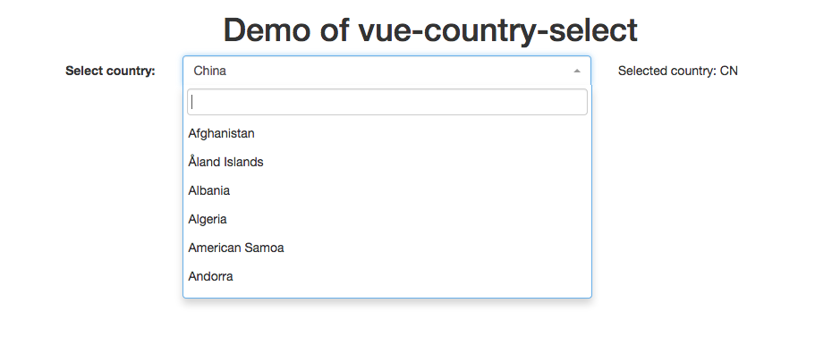

# vue-country-select

[](https://circleci.com/gh/Haixing-Hu/vue-country-select/tree/master)
[](https://coveralls.io/github/Haixing-Hu/vue-country-select?branch=master)
[](https://www.bithound.io/github/Haixing-Hu/vue-country-select)
[](https://david-dm.org/Haixing-Hu/vue-country-select)
[](https://david-dm.org/Haixing-Hu/vue-country-select#info=devDependencies)

A Vue.js component implementing the select control used to select countries.

# Demo

The demo page is [HERE](http://haixing-hu.github.io/vue-country-select/demo.html).



# Requirements

- [Vue.js](https://github.com/yyx990803/vue) `^1.0.24`
- [vue-select](https://github.com/Haixing-Hu/vue-select) `^0.2.3`
- [vue-i18n-plugin](https://github.com/Haixing-Hu/vue-i18n) `^0.2.2` This is optional.

# Instllation

## npm

```shell
$ npm install vue-country-select
```

## bower

```shell
$ bower install vue-country-select
```

# Usage

The HTML snippets are as follows:

```html
<div id="app">
  <div class="form-horizontal">
    <div class="form-group">
      <label for="country-select" class="col-sm-3 control-label">
        Select country:
      </label>
      <div class="col-sm-5">
        <vue-country-select class="vue-country-select" name="country-select"
                            :model.sync="result" language="en-US">
        </vue-country-select>
      </div>
      <div class="col-sm-4">
        <p class="form-control-static">
          Selected country: <span class="vue-result">{{result}}</span>
        </p>
      </div>
    </div>
  </div>
</div>
```

The Javascript snippets are as follows:

```javascript
var Vue = require("vue");
var vm = new Vue({
  el: "#app",
  components: {
    "vue-country-select": require("vue-country-select")
  },
  data: {
    result: null
  }
});
```

# Component Properties

## `model`

The model bind to the control, which must be a two way binding variable.

Note that the value of model could be set to `null`, and in that case the
selection will be set to nothing. Also, if the selection is set to nothing
(that is, the user delete the text in the input box of the selector), the
value of the model will be set to `null` instead of an empty string.

## `searchable`

The optional flag indicates whether to show the search box.

## `language`

The optional code of language used by the
[select2](https://github.com/select2/select2) plugin.

The supported languages are exactly the same as the supported languages of the
[select2](https://github.com/select2/select2) plugin. In order to use the
supported language, you must also include the corresponding "i18n" js file of
the [select2](https://github.com/select2/select2) plugin in your HTML file.

Note that the language code passed to this property could be a locale code
consists of a language code and a country code, e.g., `"en-US"`. The component
will automatically convert the locale code to the language code supported by
the [select2](https://github.com/select2/select2) plugin. Since some languages
have different variants in different country or region, e.g., `"zh-CN"` for the
simplified Chinese and `"zh-TW"` for the traditional Chinese, it's recommended
to use the locale code in the form of `"[language]-[country]"`.

If this property is not set, and the [vue-i18n](https://github.com/Haixing-Hu/vue-i18n)
plugin is used, the component will use the language code `$language` provided
by the [vue-i18n](https://github.com/Haixing-Hu/vue-i18n) plugin; otherwise, the
component will use the default value `"en-US"`.

## `theme`

The optional name of the theme of the [select2](https://github.com/select2/select2)
plugin. Default value is `'bootstrap'`.

Note that in order to use the bootstrap theme, you must include the CSS file
from the [select2-bootstrap-theme](https://github.com/select2/select2-bootstrap-theme/) project.
And it's very important that the above CSS file must be included AFTER the
CSS file of the bootstrap.

The following is the correct order for including CSS files:

```html
<link rel="stylesheet" type="text/css" href="http://cdn.bootcss.com/select2/4.0.0/css/select2.css">
<link rel="stylesheet" type="text/css" href="http://cdn.bootcss.com/bootstrap/3.3.5/css/bootstrap.css">
<link rel="stylesheet" type="text/css" href="https://select2.github.io/select2-bootstrap-theme/css/select2-bootstrap.css">
```

Check the [demo page](http://haixing-hu.github.io/vue-country-select/demo.html) for details.

# API

## `control`

This property is a reference to the JQuery selection of the base select
control. It could be used to call the APIs of
[select2](https://github.com/select2/select2) plugin. For example,
`select.control.val(val)` will set the value of the select to the
specified value, where `select` is the reference to the `vue-country-select`
component.

# Localization

This component could use the [vue-i18n](https://github.com/Haixing-Hu/vue-i18n)
plugin to localize the names of countries.

In order to localize this component, the localization files provided to the
[vue-i18n](https://github.com/Haixing-Hu/vue-i18n) plugin must provide the
following localization messages:

```json
{
  "country": {
    "AF": "Afghanistan",
    "AX": "Åland Islands",
    "AL": "Albania",
    "DZ": "Algeria",
    "AS": "American Samoa",
    "AD": "Andorra",
    "AO": "Angola",
    "AI": "Anguilla",
    "AQ": "Antarctica",
    "AG": "Antigua and Barbuda",
    "AR": "Argentina",
    "AM": "Armenia",
    "AW": "Aruba",
    "AU": "Australia",
    "AT": "Austria",
    "AZ": "Azerbaijan",
    "BS": "Bahamas",
    "BH": "Bahrain",
    "BD": "Bangladesh",
    "BB": "Barbados",
    "BY": "Belarus",
    "BE": "Belgium",
    "BZ": "Belize",
    "BJ": "Benin",
    "BM": "Bermuda",
    "BT": "Bhutan",
    "BO": "Bolivia, Plurinational State of",
    "BQ": "Bonaire, Sint Eustatius and Saba",
    "BA": "Bosnia and Herzegovina",
    "BW": "Botswana",
    "BV": "Bouvet Island",
    "BR": "Brazil",
    "IO": "British Indian Ocean Territory",
    "BN": "Brunei Darussalam",
    "BG": "Bulgaria",
    "BF": "Burkina Faso",
    "BI": "Burundi",
    "KH": "Cambodia",
    "CM": "Cameroon",
    "CA": "Canada",
    "CV": "Cape Verde",
    "KY": "Cayman Islands",
    "CF": "Central African Republic",
    "TD": "Chad",
    "CL": "Chile",
    "CN": "China",
    "CX": "Christmas Island",
    "CC": "Cocos (Keeling) Islands",
    "CO": "Colombia",
    "KM": "Comoros",
    "CG": "Congo",
    "CD": "Congo, the Democratic Republic of the",
    "CK": "Cook Islands",
    "CR": "Costa Rica",
    "CI": "Côte d'Ivoire",
    "HR": "Croatia",
    "CU": "Cuba",
    "CW": "Curaçao",
    "CY": "Cyprus",
    "CZ": "Czech Republic",
    "DK": "Denmark",
    "DJ": "Djibouti",
    "DM": "Dominica",
    "DO": "Dominican Republic",
    "EC": "Ecuador",
    "EG": "Egypt",
    "SV": "El Salvador",
    "GQ": "Equatorial Guinea",
    "ER": "Eritrea",
    "EE": "Estonia",
    "ET": "Ethiopia",
    "FK": "Falkland Islands (Malvinas)",
    "FO": "Faroe Islands",
    "FJ": "Fiji",
    "FI": "Finland",
    "FR": "France",
    "GF": "French Guiana",
    "PF": "French Polynesia",
    "TF": "French Southern Territories",
    "GA": "Gabon",
    "GM": "Gambia",
    "GE": "Georgia",
    "DE": "Germany",
    "GH": "Ghana",
    "GI": "Gibraltar",
    "GR": "Greece",
    "GL": "Greenland",
    "GD": "Grenada",
    "GP": "Guadeloupe",
    "GU": "Guam",
    "GT": "Guatemala",
    "GG": "Guernsey",
    "GN": "Guinea",
    "GW": "Guinea-Bissau",
    "GY": "Guyana",
    "HT": "Haiti",
    "HM": "Heard Island and McDonald Islands",
    "VA": "Holy See (Vatican City State)",
    "HN": "Honduras",
    "HK": "Hong Kong",
    "HU": "Hungary",
    "IS": "Iceland",
    "IN": "India",
    "ID": "Indonesia",
    "IR": "Iran, Islamic Republic of",
    "IQ": "Iraq",
    "IE": "Ireland",
    "IM": "Isle of Man",
    "IL": "Israel",
    "IT": "Italy",
    "JM": "Jamaica",
    "JP": "Japan",
    "JE": "Jersey",
    "JO": "Jordan",
    "KZ": "Kazakhstan",
    "KE": "Kenya",
    "KI": "Kiribati",
    "KP": "Korea, Democratic People's Republic of",
    "KR": "Korea, Republic of",
    "KW": "Kuwait",
    "KG": "Kyrgyzstan",
    "LA": "Lao People's Democratic Republic",
    "LV": "Latvia",
    "LB": "Lebanon",
    "LS": "Lesotho",
    "LR": "Liberia",
    "LY": "Libya",
    "LI": "Liechtenstein",
    "LT": "Lithuania",
    "LU": "Luxembourg",
    "MO": "Macao",
    "MK": "Macedonia, the Former Yugoslav Republic of",
    "MG": "Madagascar",
    "MW": "Malawi",
    "MY": "Malaysia",
    "MV": "Maldives",
    "ML": "Mali",
    "MT": "Malta",
    "MH": "Marshall Islands",
    "MQ": "Martinique",
    "MR": "Mauritania",
    "MU": "Mauritius",
    "YT": "Mayotte",
    "MX": "Mexico",
    "FM": "Micronesia, Federated States of",
    "MD": "Moldova, Republic of",
    "MC": "Monaco",
    "MN": "Mongolia",
    "ME": "Montenegro",
    "MS": "Montserrat",
    "MA": "Morocco",
    "MZ": "Mozambique",
    "MM": "Myanmar",
    "NA": "Namibia",
    "NR": "Nauru",
    "NP": "Nepal",
    "NL": "Netherlands",
    "NC": "New Caledonia",
    "NZ": "New Zealand",
    "NI": "Nicaragua",
    "NE": "Niger",
    "NG": "Nigeria",
    "NU": "Niue",
    "NF": "Norfolk Island",
    "MP": "Northern Mariana Islands",
    "NO": "Norway",
    "OM": "Oman",
    "PK": "Pakistan",
    "PW": "Palau",
    "PS": "Palestine, State of",
    "PA": "Panama",
    "PG": "Papua New Guinea",
    "PY": "Paraguay",
    "PE": "Peru",
    "PH": "Philippines",
    "PN": "Pitcairn",
    "PL": "Poland",
    "PT": "Portugal",
    "PR": "Puerto Rico",
    "QA": "Qatar",
    "RE": "Réunion",
    "RO": "Romania",
    "RU": "Russian Federation",
    "RW": "Rwanda",
    "BL": "Saint Barthélemy",
    "SH": "Saint Helena, Ascension and Tristan da Cunha",
    "KN": "Saint Kitts and Nevis",
    "LC": "Saint Lucia",
    "MF": "Saint Martin (French part)",
    "PM": "Saint Pierre and Miquelon",
    "VC": "Saint Vincent and the Grenadines",
    "WS": "Samoa",
    "SM": "San Marino",
    "ST": "Sao Tome and Principe",
    "SA": "Saudi Arabia",
    "SN": "Senegal",
    "RS": "Serbia",
    "SC": "Seychelles",
    "SL": "Sierra Leone",
    "SG": "Singapore",
    "SX": "Sint Maarten (Dutch part)",
    "SK": "Slovakia",
    "SI": "Slovenia",
    "SB": "Solomon Islands",
    "SO": "Somalia",
    "ZA": "South Africa",
    "GS": "South Georgia and the South Sandwich Islands",
    "SS": "South Sudan",
    "ES": "Spain",
    "LK": "Sri Lanka",
    "SD": "Sudan",
    "SR": "Suriname",
    "SJ": "Svalbard and Jan Mayen",
    "SZ": "Swaziland",
    "SE": "Sweden",
    "CH": "Switzerland",
    "SY": "Syrian Arab Republic",
    "TW": "Taiwan, Province of China",
    "TJ": "Tajikistan",
    "TZ": "Tanzania, United Republic of",
    "TH": "Thailand",
    "TL": "Timor-Leste",
    "TG": "Togo",
    "TK": "Tokelau",
    "TO": "Tonga",
    "TT": "Trinidad and Tobago",
    "TN": "Tunisia",
    "TR": "Turkey",
    "TM": "Turkmenistan",
    "TC": "Turks and Caicos Islands",
    "TV": "Tuvalu",
    "UG": "Uganda",
    "UA": "Ukraine",
    "AE": "United Arab Emirates",
    "GB": "United Kingdom",
    "US": "United States",
    "UM": "United States Minor Outlying Islands",
    "UY": "Uruguay",
    "UZ": "Uzbekistan",
    "VU": "Vanuatu",
    "VE": "Venezuela, Bolivarian Republic of",
    "VN": "Viet Nam",
    "VG": "Virgin Islands, British",
    "VI": "Virgin Islands, U.S.",
    "WF": "Wallis and Futuna",
    "EH": "Western Sahara",
    "YE": "Yemen",
    "ZM": "Zambia",
    "ZW": "Zimbabwe"
  }
}
```

If no [vue-i18n](https://github.com/Haixing-Hu/vue-i18n) is used, or the
localization file of the plugin does not provide the localization name of a
country, the default English name will be used.

Some localization files could be found in the `src/i18n` directory.

# Data

The country list comes from http://data.okfn.org/data/core/country-list

# Contributing

- Fork it !
- Create your top branch from `dev`: `git branch my-new-topic origin/dev`
- Commit your changes: `git commit -am 'Add some topic'`
- Push to the branch: `git push origin my-new-topic`
- Submit a pull request to `dev` branch of `Haixing-Hu/vue-country-select` repository !

# Building and Testing

First you should install all depended NPM packages. The NPM packages are used
for building and testing this package.

```shell
$ npm install
```

Then install all depended bower packages. The bower packages are depended by
this packages.

```shell
$ bower install
```

Now you can build the project.
```shell
$ gulp build
```

The following command will test the project.
```shell
$ gulp test
```

The following command will perform the test and generate a coverage report.
```shell
$ gulp test:coverage
```

The following command will perform the test, generate a coverage report, and
upload the coverage report to [coveralls.io](https://coveralls.io/).
```shell
$ gulp test:coveralls
```

You can also run `bower install` and `gulp build` together with the following
command:
```shell
npm run build
```

Or run `bower install` and `gulp test:coveralls` together with the following
command:
```shell
npm run test
```

# License

[The MIT License](http://opensource.org/licenses/MIT)
